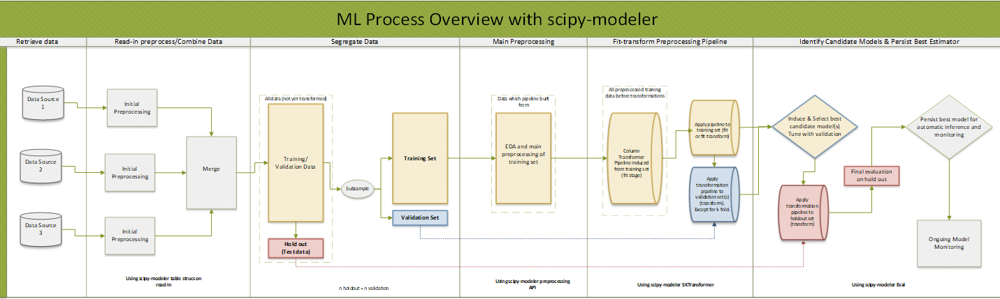
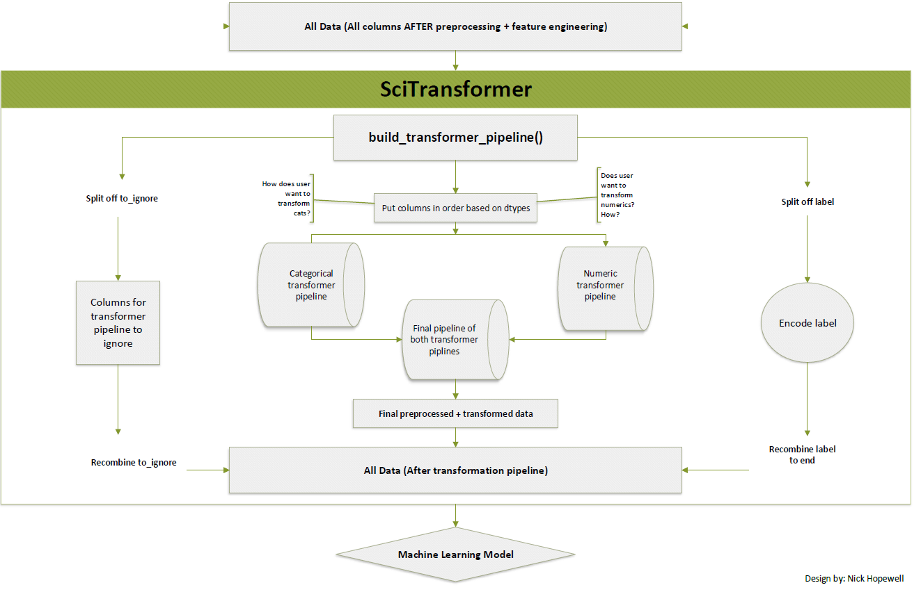
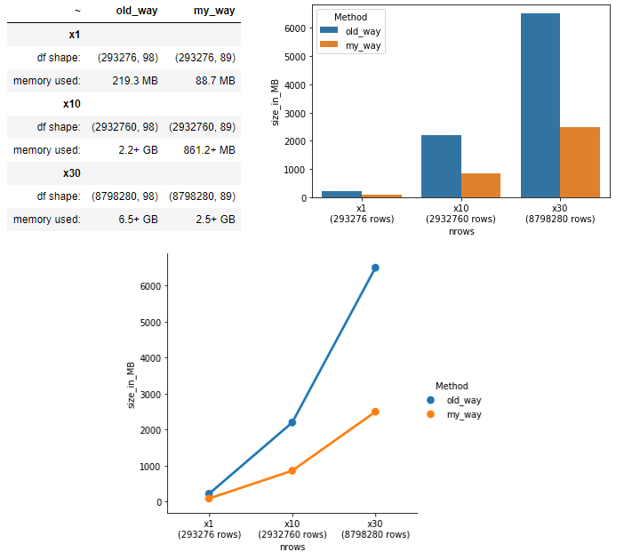

The primary contact for this for this project is Nick Hopewell  
<nicholashopewell@gmail.com>    

# scipy-modeler  
--- 
An overview of some applications and goals of scipy-modeler
---
The scipy-modeler library is a Data Science library which supports data preprocessing and predictive modelling by providing methods for data input, wrangling, and modelling which every data scientist must write at some point no matter what. This library also generates a ML transformers and constructs them into data pipelines behind the scenes. Additionally, scipy-modeller also lets the user persist data pipelines and trained models to disk as binary files to be reused for production purposes. This can easily be extended to persist models to a remote repository.  
  
### What issues does scipy-modeller solve? Why use such a system?  

**Some big problems all Data Science teams need to avoid or solve**  
One major problem data science teams have is that, although most data science projects follow the same steps (reading data from a database, preprocessing the data, and building/interpreting a model), every individual scientist will implement their own functions and workflows (possibly in very different ways) creating messy and hard to manage projects and environments. In other words, it is common that new and growing teams will "reinvent the Data Science wheel" every time a new line project comes along. These tendencies often lead to situations where collaboration is much harder (taking a very long time to get on the same page) or impossible. Messy, unstructured, workflows (which are unique to each team member) make collaboration difficult because they add an unnecessary barrier to entry when a new member needs to contribute or take over a project. Instead of only needing to learn new line of business, the individual also must learn a new workflow entirely (which may be very foreign to them). If the methods were very well-documented by whoever started/leads the project, the process will take less time (but it will still take significant time). In short, time to productivity is massively hindered with this approach.  

Learning someone else’s workflow and environment is also dangerous, especially when they have not designed it well or did not write in with the intention of letting others use it at some point (which is ironic, because that is, at its heart, why we write code to begin with). This is dangerous because it makes validating behaviour of the system and its components very difficult. The behaviour of the system may be working as you believe it does, but it also might not. It will take a lot of needless exploration to determine that behaviour. And years later, things still may be failing silently to you.  

In other words, there are many unknown unknowns, even when you believe you know how the system works, you can never truly know for certain.
The process of learning a new workflow or creating a novel one time and time again can, and should be, removed entirely. These functions and workflows should be implemented once and tested well. After testing, existing lines of business ought to integrate these tested tools and they should be reused many times over. This is especially true when dealing with 'people' data (data about people themselves).  

Why is this a major problem when attempting to build a production model using people data? Because there cannot be ANY unknown unknowns. It is your responsibility to make sure the system is working how you believe it does, how your team believes it does, and how your manager believes it does. It has to be easy to understand within and across teams, and it has to do what you need it do the first time, second time, and the last time its used. And that behaviour must be easy to validate. Peoples livelihoods depend on you not making mistakes when you are taking steps to action based on patterns learned from people data.  

One final problem that must be avoided (or solved after the fact) is allowing dangerous dependencies on one person in terms of the success of a project. Anyone can leave a team or a project at any time. Anyone may need extended time off of work at any time. When only one person is able to run and manage a major project due to their knowledge of their unique workflow and methods, your team will at some point suffer. Someone will leave or take time off and that project will halt for some time. And the painful process of dissecting that past, undocumented, unstructured, work will become another employees job (or nightmare). Further bringing down the effectiveness of a team and possibly leading to a snowball effect of degraded productivity.

**Enabling management and Data Science Leads to be effective**  
The best way to ensure existing and new ensure projects are effectively managed as a team continues to grow is to develop a shared work-flow and consistent environments. To have standards and best practices managers can lean on. To apply established, well-tested, and well-designed methods to new business lines is a goal not only for the technical people, but the business people as well. Why? Because a Data Science team which wastes time reimplementing the same systems many times over will feel ineffective. That will lead to endless amounts of headaches that will ultimately lead to business objectives slowly down to a crawl. This library does not only help Data Scientists by providing a system they would need to develop anyways, it helps managers and leaders focus on business problems and trust that the technical approach is tested, reliable, and easily extensible.  

**Data Pipelines for Production (and non-production models)**  
A pipeline is simply a set of operations or tasks, executed consecutively (one after another without interruption), to arrive at some goal state. Every Data Engineering team writes pipelines on top of existing tools. They leverage core or contributed packages from a large community to build on and extend for their own purposes. They need an a consistent way for their team to interact with their backend, extract and format data, preprocess it, model it, validate results, and persist their trained models for future inference in production. In that order. And inside that larger pipeline, there are many smaller pipelines. And inside those small pipelines, you'll find even smaller ones. Sometimes a pipeline is a simple order of execution, and sometimes its an actual class that constructs and executes such steps programmatically (both of these types of pipelines are used and implemented in this software). These engineers do not write such pipelines from scratch every time they need to use one. They do it once, they do it well, and they copy and paste that pipeline to each of their lines of business. They write enough code to build a very-well functioning system, and then they focus on refactoring/improving it when needed, and reusing it as much as possible. This library provides both a high-level order of operations (described in the 3rd sentence of this paragraph) and also a pipeline factory and pipeline manager to order, build, and execute pipelines programmatically behind the scenes so the user does not need to do this (as it is an extremely error prone process).  

**A Data Processing API**  
Going back to consistency and structure of workflows. Recall that every data scientist must write their own methods to wrangle data. But these methods are always similar for tabular data. Filtering, mutating, expanding the feature space, resampling the data. These are steps we all take constantly as Data Scientists. So why would we all implement them in our own way knowing that we are all surely going to make our own mistakes along the way? Why spend time test our own code and fixing these problems again and again? This software provides a robust data preprocessing API for structured data (the kind read from a relational database or pulled into memory from a file such as a CSV) which implements common (and more advanced) operations on tabular data stored within a Pandas dataframe. This API is very easy to validate and extend and can be used as long as you are working with structured data.
  
  
### Main goals of the library:  
1) greatly simplify and better-structure data preprocessing (including feature extraction/engineering) by exposing an easy to use API which interacts with a database (using the ODBC API via pyodbc) and reads data into/manipulates a Pandas DataFrame object.     
2) implement best-practices for a) working with data in-memory using Pandas (including memory and data type management), b) processing data in a reproducible and intuitive way (structured naming conventions, consistent methodologies, etc.), and c) handling resampling and validation techniques before model results are interpreted.    
3) automate the building of Machine-Learning transformation pipelines and apply their application before modelling.    
4) provide a dynamic manager (used as a decorator) to allow the user to construct their own easy to alter and extend high-level workflows however is best for them for each project (capturing the major steps they take).   
5) allow a model to easily be productionalized (including automatic execution of preprocessing streams, transformations, data splitting, candidate model training and validation (with hyper parameter tuning optional), performance evaluation, and persistence of a 'best-fitting' model to a binary file for use for automatic inference.   
6) To have assumptions programmed as assertions to define what user behaviour is expected at each stage in the process. 

### An overview of the process  

The image below shows how scipy-modeller captures each stage of a data science production cycle from data read-in, preprocessing, and transformation, to data splitting, modelling, validation, and persistence. 

   

As seen above in the transform data step, the "Column transformer pipeline" step requires a better visualization to capture the process. This process can be seen below.   
   

  

This transformation process builds small transformers based on datatypes it discovers in a passed table (which has already been preprocessed with the preprocessing API) and builds those transformers into a larger transformation pipeline.  

### Notes  
--- 
scipy-modeler does a lot of the heavy-lifting of data processing upon reading in from the database. This relies on the use of a 'table_struc', or table structure, passed as a dict to the tables schema. This is user-defined ahead of time (before reading data into memory). The key,value pairs of this dict are to be specified as follows {'column_name': datatype}. For instance: my_table_struc = {'employee_name': Object, 'salary': float, 'seniority_level': category}. ONLY columns you wish to read in from the database should be included, the non-specified columns will never be read into data (an SQL-statement is generated behind the scenes), rather than everything being read into memory and then filtered out later. If no structure is passed, the table schema will default to None, all columns will be read in, and datatypes will be inferred. Passing a struc dict will often times greatly reduce the memory footprint of the data (especially if the data contains many categorical types) and structure data types, grouping them together, making transformation piplines easier to generate and configure. Passing a struc dict is ALWAYS recommended for each table being read into memory.
See Jupyter Notebook exampled to understand how these strucs are used.
Using these strucs is not only clever and efficient (saves many steps one might need to repeat every time she/he reads data into a local dataframe), they greatly reduce the memory footprint of your data. Below are some example tests showing the memory savings using this approach versus a standard 'read-in, filter and format after' approach.
  

